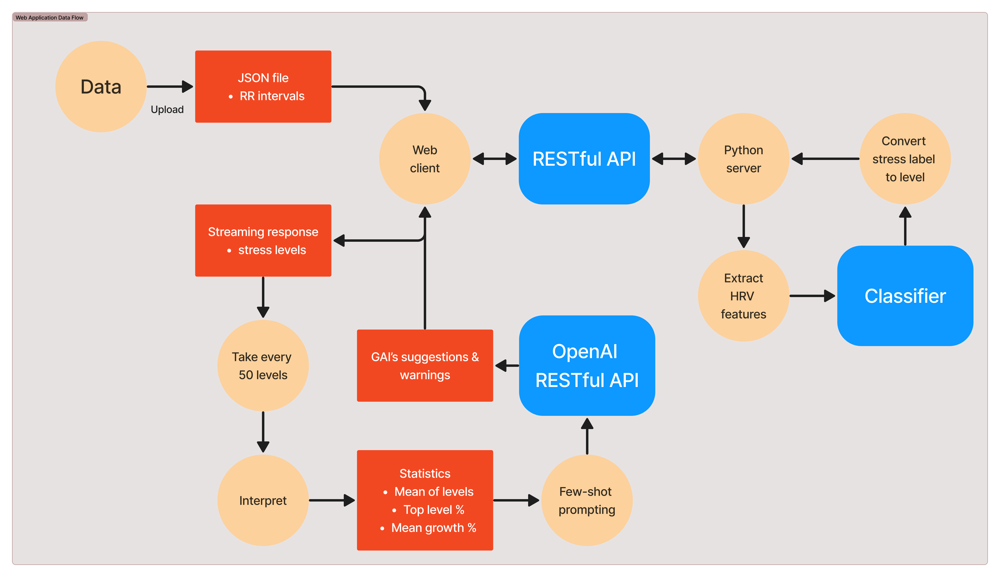

`preprocess.ipynb` is a data processing and transformation pipeline for preprocessing and feature extraction of Heart Rate Variability (HRV) raw data:

1. **Environment Setup:**
   - Install the required dependencies using `%pip install -q -r requirements.txt`.
   - Set up the environment by importing necessary libraries, such as `pandas`.

2. **Raw Data Preparation:**
   - Extract the raw data files from the compressed archive if not already extracted.
   - Load the label data and RR intervals (RRI) data.

3. **Label Data Processing:**
   - Merge the label data from CSV files into a single dataframe.
   - Display the contents of the label data.

4. **RRI Data Processing:**
   - Merge all RRI data files into a single dataframe.
   - Display the contents of the RRI data.

5. **Merge Label and RRI Data:**
   - Merge the label data and RRI data based on the index into a single dataframe.
   - Remove label data for rest states.
   - Save the merged data as a JSON file.

6. **Transformation and Feature Extraction:**
   - Use multiprocessing for parallel processing of data for each subject and extract HRV features.
   - Save the extracted features into a new dataframe.
   - Reference: Nkurikiyeyezu, Kizito & Shoji, Kana & Yokokubo, Anna & Lopez, Guillaume. (2019). Thermal Comfort and Stress Recognition in Office Environment. 10.5220/0007368802560263.

7. **Save Transformed Data:**
   - Save the transformed data as a compressed CSV file.

In summary, this code is aimed at extracting features from raw physiological data to prepare for subsequent machine learning model training and inference testing (User Acceptance Test). By utilizing multiprocessing, it efficiently handles a large volume of raw data.
