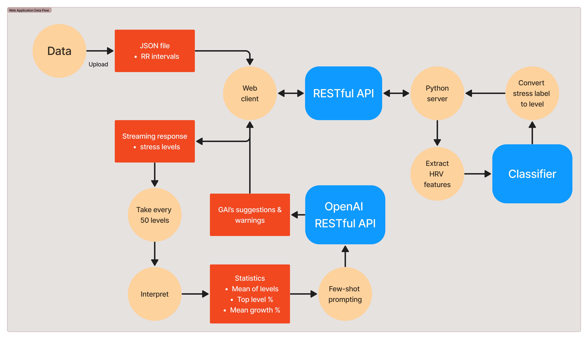

`preprocess.ipynb` 是一個數據處理和轉換的流程，針對心率變異性（HRV）的原始數據進行預處理和特徵提取：

1. **環境設置：**
   - 安裝所需的依賴庫，使用 `%pip install -q -r requirements.txt`。
   - 設置環境，導入必要的庫，例如 `pandas`。

2. **原始數據準備：**
   - 從壓縮文件中提取原始數據文件，如果尚未提取。
   - 載入標籤數據和 RR 間隔（RRI）數據。

3. **標籤數據處理：**
   - 將 CSV 中的標籤數據合併成一個數據框。
   - 顯示標籤數據的內容。

4. **RRI 數據處理：**
   - 將所有 RRI 數據文件合併成一個數據框。
   - 顯示 RRI 數據的內容。

5. **合併標籤和 RRI 數據：**
   - 將標籤數據和 RRI 數據根據索引合併成一個數據框。
   - 去除休息狀態的標籤數據。
   - 將合併後的數據保存為 JSON 文件。

6. **轉換和特徵提取：**
   - 使用多進程並行處理每個主題的數據，並提取 HRV 特徵。
   - 將提取的特徵保存到一個新的數據框中。
   - 參考: Nkurikiyeyezu, Kizito & Shoji, Kana & Yokokubo, Anna & Lopez, Guillaume. (2019). Thermal Comfort and Stress Recognition in Office Environment. 10.5220/0007368802560263.

7. **保存轉換後的數據：**
   - 將轉換後的數據保存為壓縮的 CSV 文件。

總之，這份代碼是為了從原始的生理數據中提取特徵，為後續的機器學習模型訓練與推理測試（User Acceptance Test）做準備。透過多進程處理，能夠有效處理大量的原數據。
